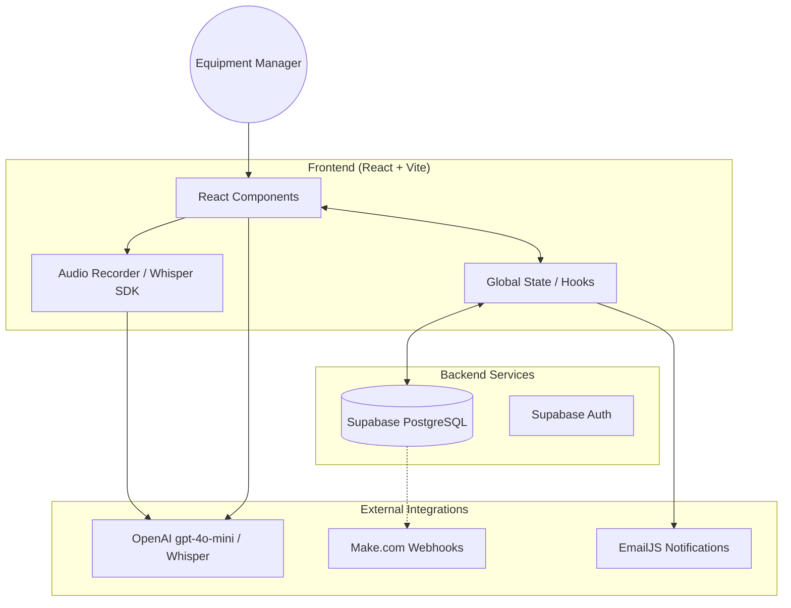
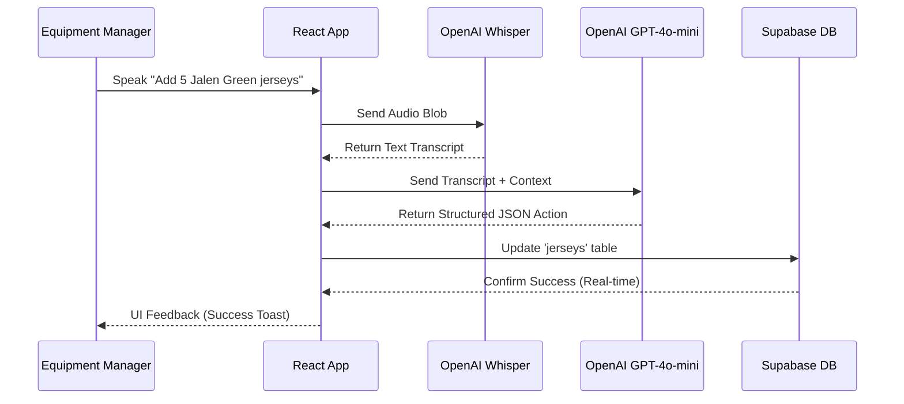
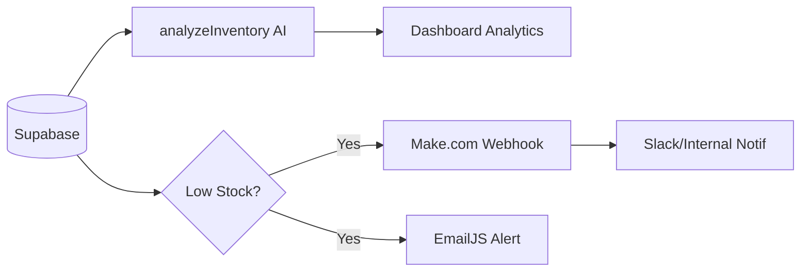

# Houston Inventory Management System

A comprehensive inventory management system for professional basketball teams, featuring AI-powered insights, voice commands, automated ordering, and real-time analytics.

## Features

### 🎯 Core Features
- **Modern Dashboard**: Real-time analytics and insights
- **Inventory Management**: Track jersey inventory with advanced filtering and sorting
- **Voice Commands**: Use natural language to manage inventory
- **Automated Ordering**: AI-powered order optimization
- **Call Logging**: Track order-related log entries
- **Real-time Notifications**: Low stock alerts and system updates

### 🤖 AI-Powered Features
- **Smart Analytics**: OpenAI-powered inventory analysis and recommendations
- **Order Optimization**: AI suggests optimal order quantities
- **Report Generation**: Automated inventory reports with insights
- **Voice Interpretation**: Natural language processing for voice commands

### 📊 Analytics & Reporting
- **Dashboard Metrics**: Total inventory, low stock items, inventory value
- **Call Analytics**: Success rates, duration tracking, order completion
- **Activity Logs**: Comprehensive audit trail
- **Export Functionality**: CSV export and AI-generated reports

## Tech Stack

- **Frontend**: React 18, TypeScript, Tailwind CSS
- **Backend**: Supabase (PostgreSQL, Auth, Real-time)
- **AI**: OpenAI GPT-4o-mini
// Voice handled in-browser via MediaRecorder or Web Speech API
- **Charts**: Recharts
- **Icons**: Lucide React
- **Notifications**: React Hot Toast

## 🏗️ System Architecture

The Houston Inventory Management System follows a modern serverless architecture, leveraging powerful integrations for AI and real-time data.



## 🔄 Data Flows

### 1. Voice Command Inventory Update
This flow shows how a natural language command like "Add 5 Jalen Green jerseys" is processed.



### 2. AI-Powered Insights & Automated Alerts
How the system analyzes inventory and triggers external workflows.




## Setup Instructions

### 1. Clone and Install Dependencies

```bash
cd houston-inventory
npm install
```

### 2. Environment Variables

Create a `.env.local` file in the root directory with the following variables:-

```env
# Supabase Configuration
VITE_SUPABASE_URL=your_supabase_project_url
VITE_SUPABASE_ANON_KEY=your_supabase_anon_key

# OpenAI API Configuration
VITE_OPENAI_API_KEY=your_openai_api_key


# Make.com Webhook Configuration
VITE_MAKE_WEBHOOK_URL=your_make_webhook_url

# EmailJS (Automatic Email Alerts)
# Create a template with variables: email/to_email, subject, message
VITE_EMAILJS_SERVICE_ID=your_emailjs_service_id
VITE_EMAILJS_TEMPLATE_ID=your_emailjs_template_id
VITE_EMAILJS_USER_ID=your_emailjs_public_key
```

### 3. Database Setup

Run the SQL script in `supabase.sql` in your Supabase SQL editor to create all necessary tables and policies.

### 4. Start Development Server

```bash
npm run dev
```

## API Integrations

### Supabase
- **Authentication**: User management and session handling
- **Database**: PostgreSQL with real-time subscriptions
- **Storage**: File uploads and asset management

### OpenAI
- **Inventory Analysis**: AI-powered insights and recommendations
- **Order Optimization**: Smart quantity suggestions
- **Report Generation**: Automated business reports
- **Email Drafting**: Professional reorder emails


### Make.com
- **Webhooks**: Low stock notifications and alerts
- **Automation**: Integration with external systems

## Usage

### Voice Commands
Try these voice commands:
- "Add 5 Jalen Green jerseys"
- "Order 3 Icon jerseys size 48"
- "Subtract 2 from Fred VanVleet Statement jerseys"

### Dashboard
- View real-time inventory metrics
- Monitor low stock items
- Track recent activity and calls
- Access quick actions

### Inventory Management
- Add, edit, and delete jersey items
- Filter by player, edition, or stock level
- Sort by various criteria
- Export data to CSV
- Place order calls directly from the interface

### Settings
- Configure low stock thresholds
- Set user preferences
- Test integrations
- Generate AI-powered reports
- Generate AI-powered reports
- View integration status

## 🧩 Component Breakdown

### **Supabase (The Core)**
- **Real-time Engine**: Automatically updates the UI when inventory changes are made via voice or manual entry.
- **Row Level Security (RLS)**: Ensures that only authorized team members can modify jersey stock levels.
- **PostgreSQL**: Stores the main `jerseys` table, `activity_logs` for audit trails, and `call_logs`.

### **OpenAI (The Brain)**
- **Whisper-1**: Transcribes audio commands with high accuracy, even in noisy equipment rooms.
- **GPT-4o-mini**: 
  - **Command Interpretation**: Converts transcribed text into structured JSON for database updates.
  - **Inventory Analysis**: Scans current stock levels to predict shortages and suggest reorder quantities.
  - **Report Generation**: Synthesizes complex data into human-readable business reports.

### **Automation Layer**
- **Make.com**: Connects Supabase triggers to external services for advanced enterprise workflows.
- **EmailJS**: Handles immediate communication when stock hits critical thresholds.

## Database Schema


### Core Tables
- `jerseys`: Main inventory items
- `settings`: System configuration
- `activity_logs`: Audit trail
// `call_logs`: (optional) generic call tracking if used
- `inventory_alerts`: Low stock notifications
- `user_preferences`: User-specific settings
- `inventory_analytics`: Historical data

## Deployment

### Vercel 
1. Connect your GitHub repository to Vercel
2. Set environment variables in Vercel dashboard
3. Deploy automatically on push to main branch

### Other Platforms
The app can be deployed to any platform that supports React applications:
- Netlify


## Contributing

1. Fork the repository
2. Create a feature branch
3. Make your changes
4. Test thoroughly
5. Submit a pull request

## License

This project is licensed under the MIT License.

## Support

For support and questions, please open an issue in the GitHub repository.
